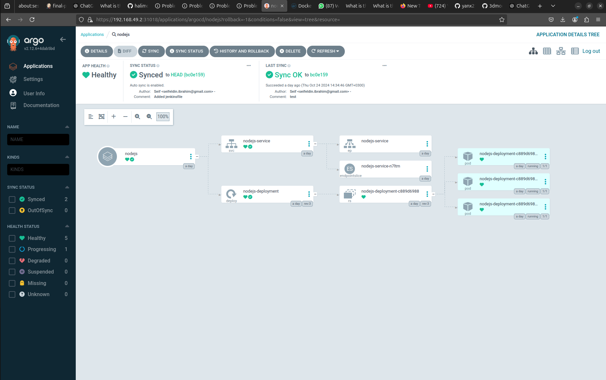
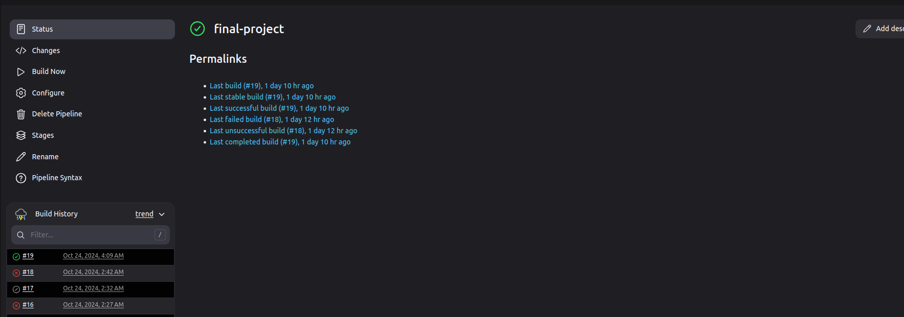
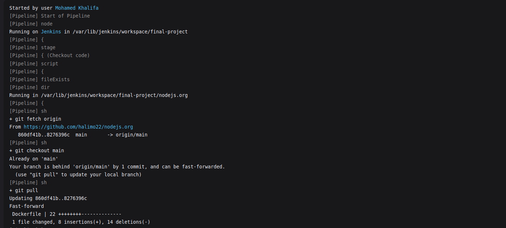
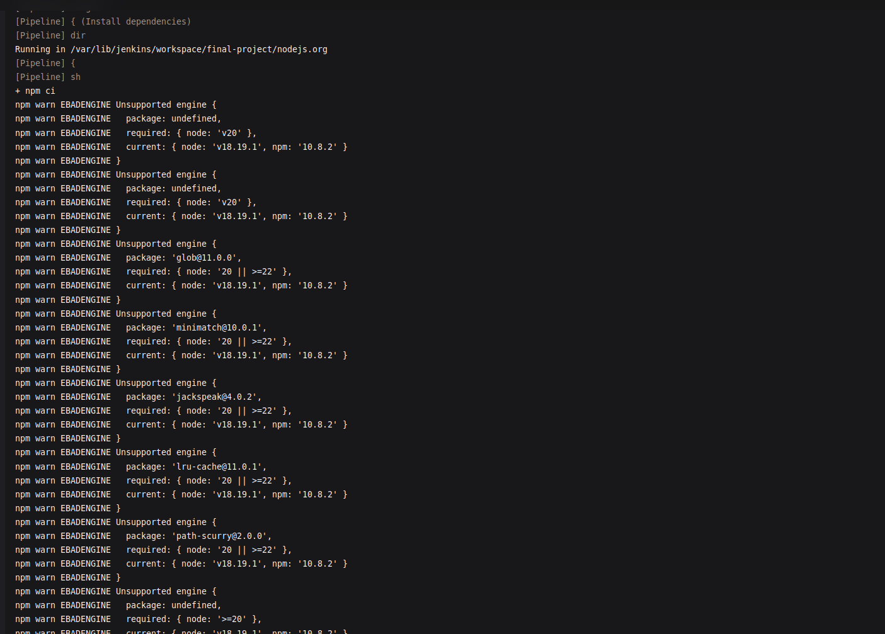
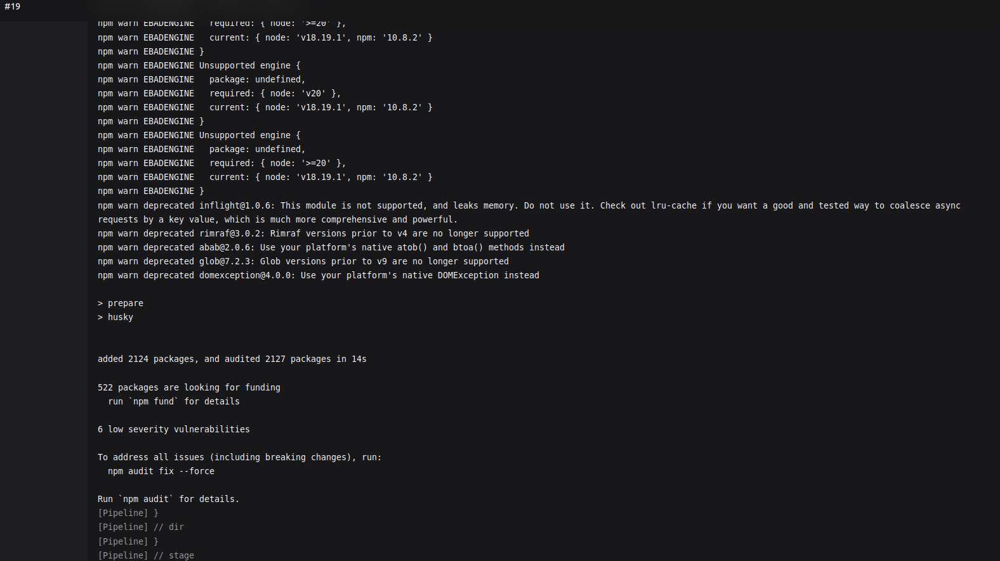
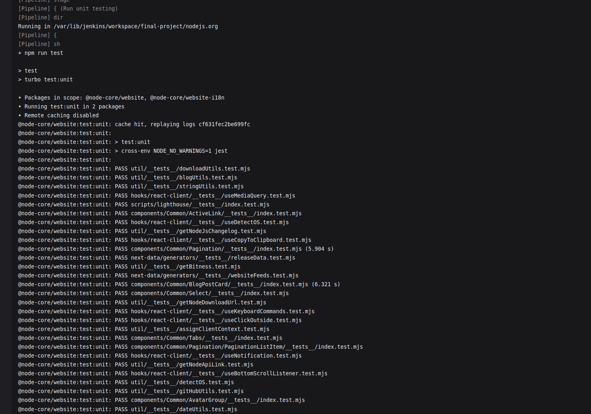
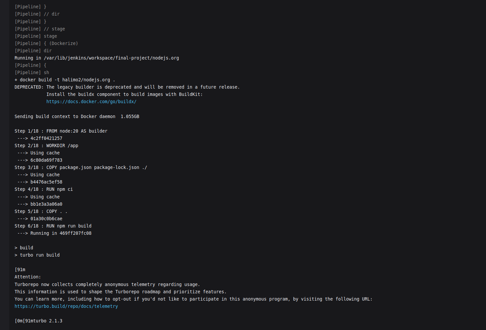
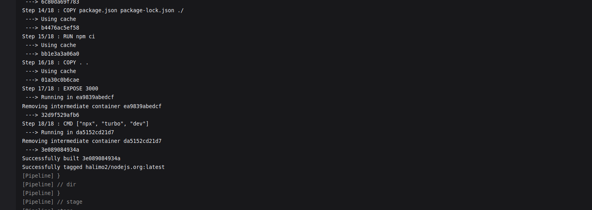
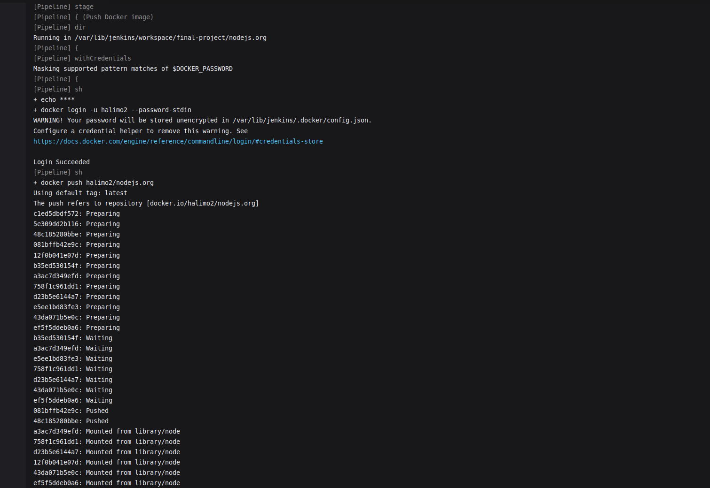
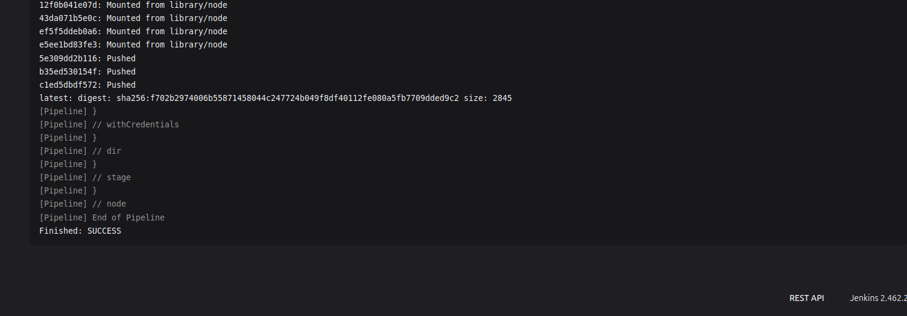

Here's the updated README with **Minikube** in the requirements section:

---

# Node.js.org DevOps Project

## Project Overview

This project automates the deployment of the [Node.js.org](https://github.com/nodejs/nodejs.org) website using CI/CD principles. It involves forking the repository, testing it locally, replicating the process within a Jenkins pipeline, and deploying to a Kubernetes cluster with ArgoCD.

## Table of Contents

1. [Requirements](#requirements)
2. [Local Setup](#local-setup)
3. [CI/CD Pipeline Setup](#cicd-pipeline-setup)
4. [Deployment with ArgoCD](#deployment-with-argocd)
5. [Folder Structure](#folder-structure)
6. [Troubleshooting](#troubleshooting)

## Requirements

- **Node.js** (18 or above)
- **Docker**
- **Jenkins** with necessary plugins:
  - Docker Pipeline
  - Git
  - Kubernetes CLI
- **Minikube** to run a local Kubernetes cluster
- **ArgoCD** set up on Minikube or any Kubernetes cluster

## Local Setup

1. **Fork the Node.js.org Repository**

   - Clone your forked repository:
     ```bash
     git clone https://github.com/halimo22/nodejs.org.git
     cd nodejs.org
     ```

2. **Build and Run Locally**

   - Install dependencies:
     ```bash
     npm install
     ```
   - Run the development server:
     ```bash
     npx turbo dev
     ```
   - The site should now be available at `http://localhost:3000`.

3. **Run Tests**
   - Ensure the application is functioning as expected by running:
     ```bash
     npm test
     ```

## CI/CD Pipeline Setup

1. **Jenkins Pipeline Configuration**

   - Configure a Jenkins pipeline to automate the following:
     - **Clone the Repository**
     - **Build the Application**
     - **Run Tests**
     - **Build Docker Image**
     - **Push to Registry**

2. **ArgoCD Deployment**
   - Define a Kubernetes `Deployment` and `Service` manifest to deploy the Docker image.
   - Set up an ArgoCD application configuration to sync with your Kubernetes manifests.

## Deployment with ArgoCD

1. **ArgoCD Application Creation**

   - Create a new ArgoCD Application pointing to your GitHub repository where the Kubernetes manifests are stored.

2. **Application Sync**
   - ArgoCD will automatically deploy and sync your application changes to the cluster.

## Folder Structure

```
nodejs.org/
│
├── Jenkinsfile                # CI/CD pipeline script
├── k8/                        # ArgoCD and Kubernetes manifests
│   ├── deployment.yaml
│   └── service.yaml
└── README.md                   # Project documentation
```

## Troubleshooting

- **Failed Builds**: Check Jenkins logs for detailed error messages.
- **ArgoCD Sync Issues**: Ensure Kubernetes manifests are correctly configured.

## License

This project is licensed under the [MIT License](LICENSE).

---

Let me know if you’d like further customizations!

## Screenshots

### ArgoCD



### Jenkins Pipeline

#### The entire pipeline



#### Fetch or Checkout stage



#### Install dependencies




#### Run Unit testing



#### Dockerize




#### Push Docker Image




### docker hub image link : https://hub.docker.com/repository/docker/halimo2/nodejs.org/general
